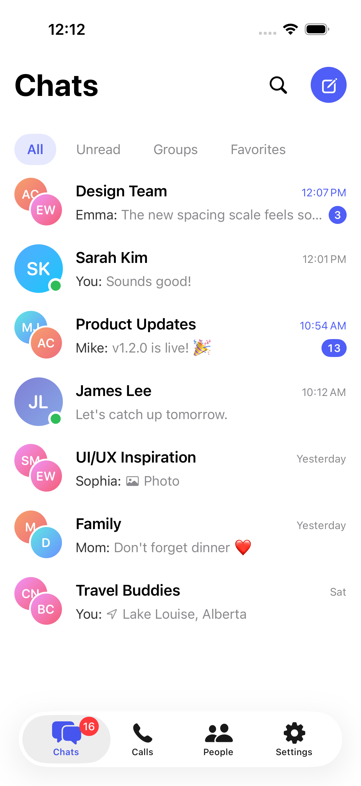
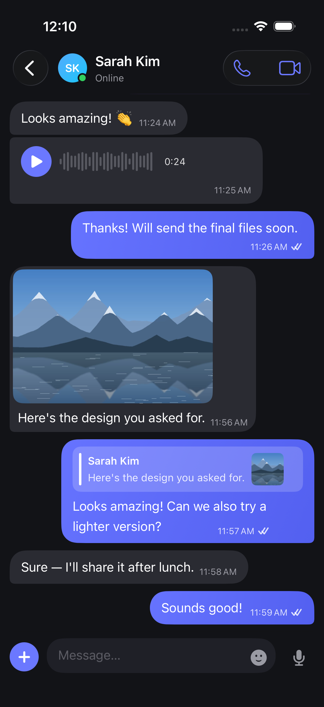
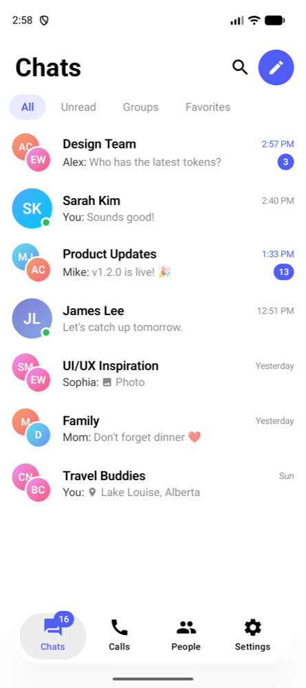
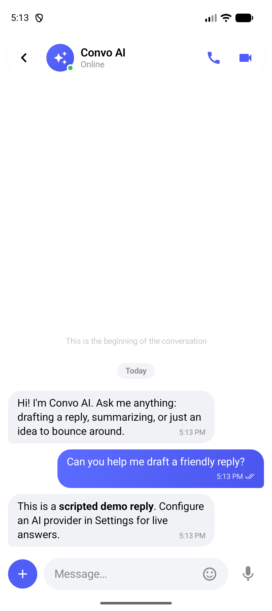

# ChatApp (ConvoKit) — Demo

Native chat experiences for iOS and Android, plus a Flutter bridge for the iOS SDK. The source repository is currently private; the demo media below is publicly available here.

## Screenshots

| iOS inbox | iOS chat · dark mode |
|---|---|
|  |  |

| Android inbox | Android AI chat |
|---|---|
|  |  |

## Video

[Watch / download the iOS walkthrough (MP4)](https://github.com/devzahirul/devzahirul/raw/refs/heads/main/assets/chatapp/convo-walkthrough.mp4)

A silent recording of the simulator demo, showing the app’s messaging experience.
